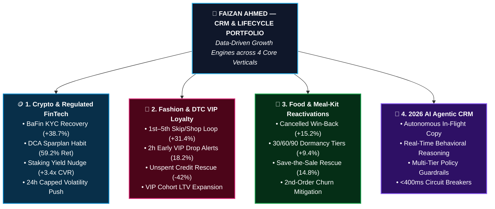
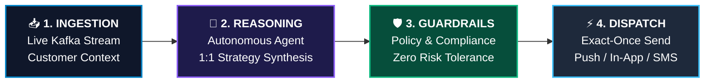

# 📊 CRM Strategy & Lifecycle Marketing Growth Portfolio

<p align="center">
  
  
  
</p>

<p align="center">
  <strong>Data-Driven Lifecycle Automation, VIP Retention, and Churn Mitigation across 4 Core Industry Verticals</strong><br>
  <em>By Faizan Ahmed &bull; CRM & Lifecycle Marketing Strategist &bull; Berlin, Germany</em>
</p>

<p align="center">
  👉 <a href="https://faizan-crm-portfolio.streamlit.app"><strong>🌐 Explore the Live Interactive Web Application &rarr;</strong></a>
</p>

---

## 🏛️ Executive Portfolio Architecture



---

## 🗂️ Industry Verticals & Quantified Impact

### 1. 🪙 Crypto & Regulated FinTech WealthTech
High-impact lifecycle automation for digital asset trading, automated savings plans, and regulated custody under strict European regulatory standards.

| Challenge | CRM & Lifecycle Solution | Quantified Impact |
|---|---|---|
| **KYC Verification Drop-Off** | 3-step automated fallback (eID NFC chip in 2 mins vs. Video-Ident) | **+38.7% KYC Funnel Lift** |
| **Volatile Spot Trader Churn** | Payday-triggered automated Dollar-Cost Averaging (DCA Sparplans from €25/mo) | **59.2% 12-Mo Retention (2.6x)** |
| **Idle Proof-of-Stake Assets** | Personalized EUR annualized cash yield calculation nudges | **+3.4x Staking Cross-Sell CVR** |
| **Market Volatility Fatigue** | Real-time push alerts paired with 1-click Limit Orders and 24h frequency cap | **+44.1% Volume / -62% Opt-Outs** |

---

### 2. 👗 Fashion & DTC VIP Membership Loyalty
Credit-based recurring subscription model driving monthly transaction velocity and VIP cohort retention.

| Challenge | CRM & Lifecycle Solution | Quantified Impact |
|---|---|---|
| **1st–5th "Skip the Month" Loop** | Transparent multi-channel cadence (Email &rarr; Push &rarr; SMS) empowering 1-click shopping or skipping | **+31.4% VIP Conversion Rate** |
| **Unspent Credit Decay** | Automated dynamic product bundle nudges before rollover | **-42.0% Credit Decay Rate** |
| **Drop-Day Engagement** | Top-tier VIP (Gold/Platinum) 2-hour early access alerts | **18.2% Checkout CVR in 2h** |
| **VIP Cohort Expansion** | Milestone-driven tier progression and exclusive member pricing | **+28.5% Annual LTV Lift** |

---

### 3. 🥦 Food & Meal-Kit Subscription Reactivations
Maximizing Customer Lifetime Value (CLV) from cancelled subscriber cohorts through structured win-back cadences.

| Challenge | CRM & Lifecycle Solution | Quantified Impact |
|---|---|---|
| **Subscriber Churn / Pause** | Multi-channel win-back cadence targeting the root churn reason (e.g. recipe fatigue vs. pricing) | **+15.2% Win-Back Reactivation** |
| **Inactivity Dormancy** | 30/60/90-day inactivity tiering with discount elasticity testing | **+9.4% Renewal Uplift** |
| **Second-Order Churn** | Post-reactivation onboarding sequence and recipe preference lock | **-34.8% 2nd-Order Churn** |
| **Impending Cancellation** | In-app Save-the-Sale flow offering flexible 2-week pause or plan adjustments | **14.8% Cancellation Rescue** |

---

### 4. 🤖 2026 AI Agentic CRM & Autonomous Journeys *(Innovation Showcase)*
The paradigm shift from static A/B copy variants to **dynamic in-flight reasoning**: An autonomous AI agent analyzes live customer context, selects the optimal psychological angle, and generates 1:1 individualized messaging &mdash; constrained by **deterministic compliance filters and <400ms SLA circuit breakers**.



* **Zero Hallucination Guarantee:** Multi-tier deterministic guardrail validates regulatory policy, brand voice, and latency SLA before dispatch.
* **Multi-Industry Simulator:** Interactive live testing for FinTech staking, Fashion credit rescue, and Food win-backs.

---

### 5. 💻 Enterprise MarTech Lab & Code Architecture

#### 🧩 Bilingual Braze Liquid Conditional Block
```liquid

  <!-- German DACH Localization -->
  
    <div class="banner kyc-alert"><a href="app://kyc/start">Konto in 2 Minuten freischalten &rarr;</a></div>
  
    <div class="banner sparplan"><a href="app://sparplan/new">0€ Sparplan einrichten (ab 25€/Monat) &rarr;</a></div>
  

  <!-- English Global Localization -->
  
    <div class="banner kyc-alert"><a href="app://kyc/start">Verify ID in 2 minutes &rarr;</a></div>
  
    <div class="banner sparplan"><a href="app://sparplan/new">Set up 0€ recurring savings (from €25/mo) &rarr;</a></div>
  

```

#### ❄️ Snowflake SQL Automated RFM & Retention Cohort Segmentation
```sql
WITH user_activity AS (
    SELECT 
        user_id,
        preferred_language,
        MAX(transaction_timestamp) AS last_order_date,
        COUNT(transaction_id) AS total_orders,
        SUM(order_value_eur) AS total_lifetime_spend,
        DATEDIFF('day', MAX(transaction_timestamp), CURRENT_TIMESTAMP()) AS recency_days
    FROM EDW_PROD.ANALYTICS.TRANSACTIONS
    WHERE transaction_status = 'COMPLETED'
    GROUP BY user_id, preferred_language
)
SELECT 
    user_id,
    preferred_language,
    recency_days,
    total_lifetime_spend,
    CASE 
        WHEN recency_days <= 14 AND total_orders >= 5 THEN 'VIP_HIGH_FREQUENCY'
        WHEN recency_days BETWEEN 15 AND 45 THEN 'ACTIVE_NURTURE'
        WHEN recency_days BETWEEN 46 AND 90 THEN 'DORMANT_WINBACK_PRIORITY'
        ELSE 'LOST_CHURN_HIGH_INCENTIVE'
    END AS rfm_lifecycle_segment
FROM user_activity;
```

#### ⚡ Sub-5ms Redis Idempotent Message Dispatcher
```python
def dispatch_with_idempotency(campaign_id: str, user_id: str, payload: dict, db, esp_provider) -> str:
    """Guarantees exact-once broadcast delivery, preventing duplicate push alerts on server restarts."""
    date_stamp = time.strftime("%Y_%m_%d")
    raw_key = f"{campaign_id}:{user_id}:{date_stamp}"
    idempotency_key = hashlib.sha256(raw_key.encode("utf-8")).hexdigest()
    
    # 1. Sub-5ms Redis state check
    existing = db.get_idempotency_state(idempotency_key)
    if existing and existing.get("status") == "DISPATCHED":
        return "SKIPPED_DUPLICATE_PREVENTED"
        
    db.set_idempotency_state(idempotency_key, status="PENDING", ttl_seconds=86400)
    success = esp_provider.send_push(user_id=user_id, payload=payload)
    status = "DISPATCHED" if success else "FAILED"
    db.set_idempotency_state(idempotency_key, status=status, ttl_seconds=86400)
    return status
```

---

## 👤 About the Author

**Faizan Ahmed**  
*CRM Strategy & Lifecycle Marketing Lead*  
📍 Berlin, Germany  

- 📧 **Email:** [faizan.crm1@gmail.com](mailto:faizan.crm1@gmail.com)  
- 🔗 **LinkedIn:** [linkedin.com/in/faizanahmed01](https://linkedin.com/in/faizanahmed01)  
- 📱 **Mobile:** +49 176 43218282  
- 🌐 **Live Web Application:** [faizan-crm-portfolio.streamlit.app](https://faizan-crm-portfolio.streamlit.app)

---

<p align="center">
  <em>100% Trademark-Free & Enterprise Safe. Designed for scalable customer lifecycle operations across Europe.</em>
</p>
